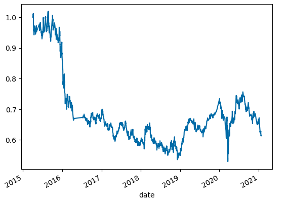
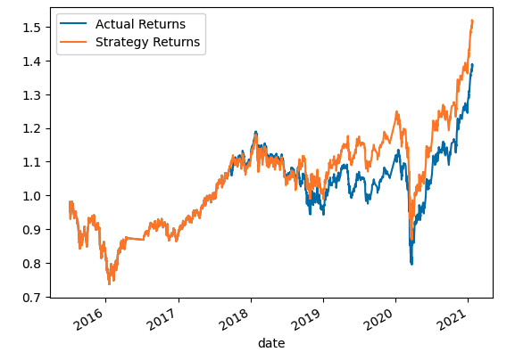
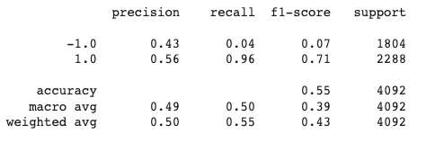
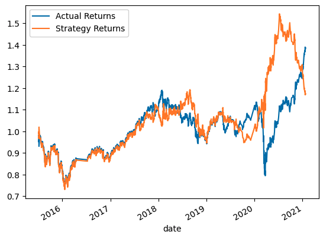
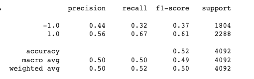
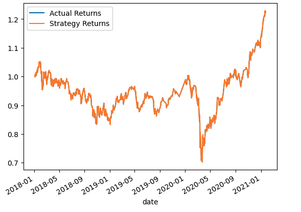
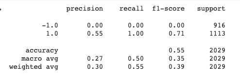

# Trading Algorithm

## This Challenge are divided into the following sections:

- Establish a Baseline Performance

- Tune the Baseline Trading Algorithm (support vector machine (SVM))

- Evaluate a New Machine Learning Classifier (AdaBoost)

- Create an Evaluation Report

### Tune the training algorithm by adjusting the size of the training dataset. 

1. Basline Trading Algorithm

Machine learning Method: support vector machine (SVM)
Training (128 examples): From 2015-04-02 15:00:00 to 2015-07-02 15:00:00 
Test (4092 examples): From 2015-07-02 15:00:00 to 2021-01-22 15:45:00

2. Use an Alternative ML Model 

Machine learning Method: AdaBoost
Training (128 examples): From 2015-04-02 15:00:00 to 2015-07-02 15:00:00 
Test (4092 examples): From 2015-07-02 15:00:00 to 2021-01-22 15:45:00

3. Data was sliced into different periods

Machine learning Method: AdaBoost
Training (1673 examples): From 2016-01-04 09:30:00 to 2018-01-04 09:30:00 
Test (2029 examples): From 2018-01-04 09:30:00 to 2021-01-22 15:45:00

